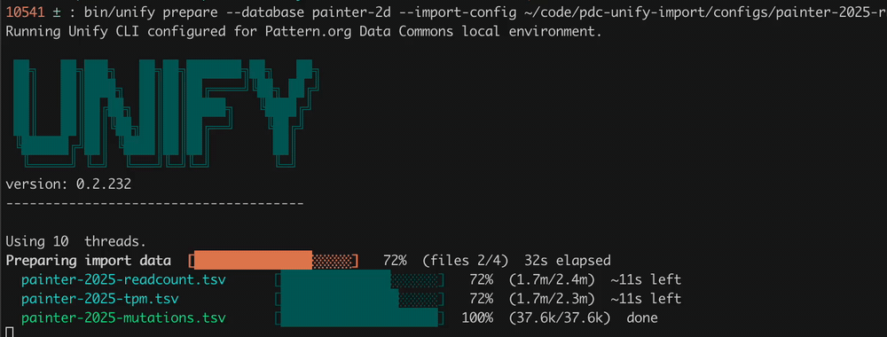

# The Unify CLI

_Note_: this page derived from LLM using unify's docs.



_Above: `unify prepare` working through a real multi-file import, with a progress bar for each input file._

The Unify CLI is the command line tool that harmonizes data into a UnifyBio system.
It turns a declarative [import config](import-config.md) and a set of TSV files into
Datomic transaction data, and transacts that data into a database.
It is an executable jar wrapped by shell scripts, and is open source
([vendekagon-labs/unify](https://github.com/vendekagon-labs/unify/)).

UnifyBio distributions, such as the Pattern distribution, put the wrapper in `bin/`:

```
bin/unify TASK [options]
```

(In the Unify repository itself, the equivalent wrapper scripts are `./unify` and `./unify-local`.)
Run it with no arguments, or with `--help`, to print the task list and options.

Every run prints a banner and the Unify version, reports how many seconds the task took,
and exits with status `0` on success or `1` on failure, so it can be scripted.

## The import loop

Most work with the CLI follows the same four steps. The first three are Unify CLI tasks;
the fourth is provided by the UnifyBio distribution.

| Step | Command | What it does |
|---|---|---|
| 1 | `request-db` | Creates a new Datomic database, installs the schema, and loads seed data. |
| 2 | `prepare` | Reads your import config and TSV files and writes transaction data to a working directory. |
| 3 | `transact` | Transacts the prepared data from the working directory into the database. |
| 4 | `validate` | Checks the database for structural, referential, and semantic problems. |

If validation (or an earlier step) turns up a problem, fix the config or the source data
and go around again. Each pass leaves files you can inspect. See
[Your First Import](tutorials/first-import.md) for a walkthrough and the
[Quickstart](tutorials/quickstart.md) for a runnable example.

```
bin/unify request-db --database my-first-db \
                     --schema-directory $SCHEMA_DIR \
                     --seed-data-directory $SEED_DATA_DIR

bin/unify prepare --import-config $IMPORT_CONFIG_PATH \
                  --schema-directory $SCHEMA_DIR \
                  --working-directory $WORKING_DIR

bin/unify transact --database my-first-db \
                   --working-directory $WORKING_DIR

bin/validate --database my-first-db --dataset "my-first-import"
```

A UnifyBio distribution may supply `--schema-directory` and `--seed-data-directory` in its
wrapper scripts, which is why the quickstart commands omit them.

## Tasks

### request-db

Creates a new Unify database named by `--database`, then initializes it with the schema in
`--schema-directory` and any reference data in `--seed-data-directory`. Fails if
`--database` is missing or the database cannot be created.

### prepare

Uses an import config to generate all the data needed to run an import. Requires
`--import-config`, `--working-directory`, and `--schema-directory`.

- The import config can be [YAML or edn](import-config.md).
- The working directory must not already exist, or must be empty, unless you pass `--resume`.
- By default, prepare stops at the first error. Pass `--continue-on-error` to have it keep
  going and report every error at the end (and in the logs), which is usually the fastest way
  to fix a large config.

### transact

Transacts everything `prepare` wrote to `--working-directory` into the database named by `--database`.
The working directory must already exist and contain prepared data.

- Transactions are sent in batches. `--tx-batch-size` sets the batch size (default `50`;
  it must be greater than 20 and less than 200).
- `--skip-annotations` leaves the import annotations out of the database.
- If the job is interrupted, for example by a network problem or a terminated process,
  re-run the same command with `--resume` to pick up where it left off
  (see [Resuming and errors](#resuming-and-errors)).

### validate

Validation checks a transacted database, including referential integrity
(every reference points at an entity that exists) and whether combinations of attributes
make sense together. It is provided by UnifyBio distributions as `bin/validate`
rather than as a core `unify` task:

```
bin/validate --database my-first-db --dataset "my-first-import"
```

Without `--dataset`, it defaults to the most recent dataset in the database.

### retract

Removes a dataset from a database: `--dataset` names the dataset to retract from `--database`.

```
bin/unify retract --database my-first-db --dataset "my-first-import"
```

### list-dbs and delete-db

`list-dbs` lists the current databases. `delete-db` deletes the database named by `--database`.
Dev databases are cheap, so it is normal to delete and re-request one while you iterate.

### Schema tasks

These work on a Unify schema directory (`schema.edn`, `metamodel.edn`, and `enums.edn`).

| Task | What it does | Needs |
|---|---|---|
| `compile-schema` | Builds a schema directory from a single Unify schema definition. | `--unify-schema`, `--schema-directory` |
| `infer-schema` | Infers a Unify schema definition from a compiled schema directory. Check the output for `:unify.error/*` keys. | `--schema-directory`, `--unify-schema` |
| `infer-metaschema` | Generates a basic Datomic analytics metaschema, used for the Trino/SQL integration. | `--schema-directory`, `--metaschema` |
| `infer-json-schema` | Generates a JSON schema for the import config, so editors can autocomplete and check YAML configs. | `--schema-directory`, `--json-schema` |

The JSON schema task is covered in [Import Config](import-config.md#configuring-json-schema-for-editor-assistance-with-yaml-config-files).
The inference tasks are in early alpha, and their output should be reviewed.

## Options

| Option | Used by | Description |
|---|---|---|
| `--database NAME` | `request-db`, `transact`, `retract`, `delete-db`, `validate` | The database to run against. |
| `--import-config FILE` | `prepare` | Import config file, YAML or edn. |
| `--working-directory DIR` | `prepare`, `transact` | Where `prepare` writes its output, and where `transact` reads it from. |
| `--schema-directory DIR` | `request-db`, `prepare`, schema tasks | Directory containing the Unify schema (Datomic schema plus metamodel annotations). |
| `--seed-data-directory DIR` | `request-db` | Reference data to load when the database is created. |
| `--dataset NAME` | `retract`, `validate` | The dataset to retract, or to validate. |
| `--unify-schema FILE` | `compile-schema`, `infer-schema` | An edn file containing a Unify schema definition. |
| `--metaschema FILE` | `infer-metaschema` | Output file for the Datomic analytics metaschema. |
| `--json-schema FILE` | `infer-json-schema` | Output file for the import config JSON schema. |
| `--tx-batch-size N` | `transact` | Datomic transaction batch size (default `50`, greater than 20 and less than 200). |
| `--resume` | `transact` | Resume a previously started transact. |
| `--skip-annotations` | `transact` | Do not transact annotations into the database. |
| `--continue-on-error` | `prepare` | Keep going after errors and report them all at the end. |
| `-h`, `--help` | all | Print usage. |

## Resuming and errors

**Resuming a transact.** Large imports can take a while, and a network hiccup or a stopped
process can leave a transact half finished. Run the same `transact` command again with
`--resume`. Unify skips the import job entity it already wrote and finds the transactions
that previously succeeded before continuing, so expect a pause at the start.

**Reading errors.** When something fails, Unify prints the failing area and the problem
(for example, a reference to an entity that does not exist, or a bad value), and exits with status `1`.
If a transact finishes with anomalies, it prints them and points you to the logs.
For a config with many problems, run `prepare` with `--continue-on-error` to see them all at once.

**Database names.** If `--database` names a database that does not exist, the CLI stops with
`No such database`. Either the name is wrong, or the database was deleted (for example, removed
for inactivity on a hosted system). Use `list-dbs` to check.

**Starting over.** To redo an import from scratch, use a new `--working-directory` (or empty the old one),
and either `retract` the dataset from the database or delete the database and `request-db` a fresh one.
